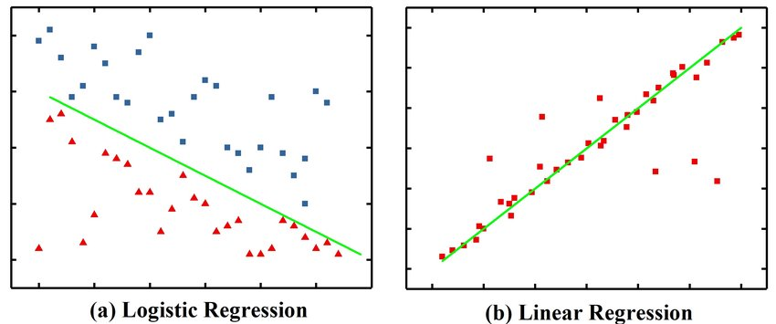

# Lab1: Linear Regression & Logistic Regression

## 1 - Objectives

* Getting to know Keras platform.
* Getting to know how to use Google Colaboratory.
* Building a linear regression model.
* Building a logistic regression model.
* Try different experiments with data preprocessing, and model hyper parameters.

## 2 - Introduction to Keras

* Keras is a high-level neural network API, written in Python and capable of  running on top of TensorFlow, CNTK, or Theano.
* We will be concentrating on using Tensorflow.Keras on top of TensorFlow.
* All the information needed to use Keras API can be found in [this documentation](https://www.tensorflow.org/tutorials/).

## 3 - Introduction to Colaboratory

* Colaboratory is a free Jupyter notebook environment that requires no setup and runs entirely in the cloud.
* You can get all the information you need about how to use Colaboratory from [this link](https://colab.research.google.com/notebooks/welcome.ipynb).

## 4 - Requirements

* Solve [part 1](lab1_part1.ipynb) of the assignment and deliver a filled ipython notebook that shows your best outpout found in your experiments in this part.
* Solve [part 2](lab1_part2.ipynb) of the assignment and deliver a filled ipython notebook that shows your best outpout found in your experiments in this part.
* You should deliver a report explaining all your work and your experiments.
